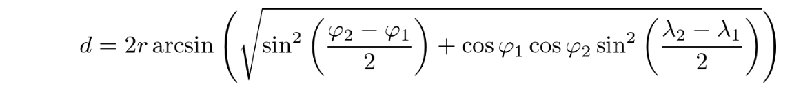

[](https://classroom.github.com/a/lW5EDw8F)
# Homework 4

This homework assignment will have you writing classes in Python as part of more complete applications.

## `poetry`

This assignment depends on a third-party module for the first time. You will need to make sure it installed on your local system.

The recommended way of installing third-party modules is to use a tool called `poetry`.

First, install `poetry` if you haven't already.

See [Installing Poetry](https://people.cs.uchicago.edu/~jturk/mpcs51042/assignments/general/#using-poetry) if you need help.

Second, install the dependencies: Within the `homework4` directory, run `poetry install`.

(If you are familiar with other Python package managers such as `conda` or `pip`, you may use whichever you prefer as long as you can install the dependency on `rich`. We will only be able to provide support for `poetry`.)


## Problem 1 - Schools

For this problem, we will again be working with real data obtained from https://data.cityofchicago.org.

We'll be using object-oriented programming to build the foundation for a "Chicago Public Schools" application.

`schools/schools.csv` is a CSV file with data on each school in Chicago.  See `schools/csv_example.py` for an example of how to read a CSV file using Python's built in `csv` module.  You may use as much of that code as you wish in your implementation.

You'll need to write three classes, as defined below.  **You must write these in a new file named `schools/schools.py`**

Again, note that you may add any additional attributes & methods as you see fit, but only the interfaces described below will be tested.

### `School`

Write a class named `School`, each instance of which will represent a single public school in Chicago.

- `__init__(self, data)` should receive a dictionary corresponding to a row in the CSV file.  In the body it should create the following attributes:
    - `self.id`: The unique ID of the school (`SCHOOL_ID` column).
    - `self.name`: The name of the school. (`SCHOOL_NM` column).
    - `self.address`: The address of the school (`SCH_ADDR` column).
    - `self.grades`: A list of grades taught at the school.  Must be an actual `list`, not the string from the CSV.
    - `self.school_type`: The type of school. (`SCH_TYPE`) column.
    - `self.location`: An instance of the `Coordinate` class (see below) representing the location of the school.

- The `distance(self, coord)` method should accept an instance of `Coordinate` and return the distance in miles from the specified location to the school.  (Formula described below.)
- The `full_address(self)` method should return a multi-line string in the standard address format of:
    <street address>
    Chicago, IL <zip code>

Finally, The string representation of a school should look like:

```
School(EDISON PARK)
```

### `Coordinate`

The `Coordinate` class will store a latitude, longitude pair indicating a physical location on Earth.

- `__init__(self, latitude, longitude)` should accept two floats that represent the latitude and longitude in degrees.
- The `distance(self, coord)` method should accept another instance of `Coordinate` and return the distance in miles to it from another location.
- The `as_radians(self)` method should return a tuple of the latitude and longitude in radians.

Finally, The string representation of a coordinate should look like:

```
Coordinate(41.7934793304, -87.7113699217)
```

### `SchoolSystem`

The `SchoolSystem` class stores information on all the public schools in the city.

- `__init__(self, filename)` accepts a filename for the CSV file in which our school data is stored.  It should create a public attribute `schools` that is a list of `School` instances.
- The `get_schools_by_type(self, school_type)` method accepts a type (e.g. 'Charter') and returns a list of `School` instances of that type.
- The `get_schools_by_grade(self, *grades)` method accepts one or more grades as strings (e.g. 'K', '3') and returns a list of `School` instances that teach *all* of the given grades.
- The `nearby_schools(self, coord, radius=1.0)` method accepts an instance of `Coordinate` and returns a list of `School` instances that are within `radius` miles of the given coordinate.

### Calculating Distance

School locations are given as latitude, longitude pairs.

Calculating the distance between these points can be done using the [Haversine Formula](https://en.wikipedia.org/wiki/Haversine_formula)



`d` is the distance between two points.

`r` is the radius of the earth (use 3961 miles)

`φ1` and `φ2` are the latitudes of the two points **in radians**.

`λ1` and `λ2` are the longitudes of the two points **in radians**.

You will need to use Python's `math` library in this problem:

https://docs.python.org/3/library/math.html

### Examples

One benefit of having a well defined interface is that it enables different members of a team to work on the application at the same time. While you were working on the implementation above, you can imagine that another coworker wrote `schools/app.py`.

(You should not make changes to `app.py`)

To run the application run `poetry run python schools/app.py`.

Some example output:


You can use `app.py` to test your work, but you will likely also want to test individual components as you see fit.

We are only grading code submitted in `schools/schools.py`, but you may add additional code to `app.py` as you see fit.

## Problem 2 - Card Game

For Problem 2, you will gain more practice building classes in Python and also give you the opportunity to build an actual application on your own.

In this application, you will build a simple version of the card game, Blackjack with a terminal UI. The classes in the game will include: a `Card`, a `Deck`, and `Hand`. On your own, you will determine how to put these classes together to build the actual game.

### Simplified Blackjack Rules

The rules for Blackjack can be quite extensive, however, for this assignment you will only implement the rules below:

- There will be two players in the game, the player, and the dealer.
- Cards 2-10 are worth the value on the card.
- Face cards, Jack, Queen, King, are worth 10.
- An Ace is always worth 11 points in our game.

A round will go through the following process:

1. The deck is shuffled.
2. The player and dealer each receive two cards from the deck.
3. The player's turn comes first:
  - The player is shown **both of their cards as well as value of their hand** (the sum of card values) and can choose to take another card from the deck (hit) or stop at the current value (stand).
  - If the player chooses to hit, they are given a new card and the total is recalculated.
  - If the player's score is above 21, the player loses (bust).
  - The player may repeat this process until they choose to stand, or bust.
4. If the player did not bust, the dealer plays.
  - The dealer plays automatically, choosing to hit while their hand's value is less than 17.  (i.e. The dealer automatically stands on 17 and above.)
5. If the player and dealer both avoided a bust, then the hand with the highest value wins the game.
   If they have the same hand value, the hand is a tie (push).


### Requirements

#### `Card`

Implement a `Card` class to represent a single card. The `Card` class must have the following attributes/methods/properties:

A card class will hold the information on a single card, its `suit`, and `value`.

- `__init__(suit, value)` takes in one of the defined class constants for `suit`, and a value which will be a string
 '2', '3', '4', '5', '6', '7', '8', '9', '10', 'J', 'K', 'Q', or 'A'.
- Define a method named `value()` that returns the card numeric value as defined in the rules above.
- Define a method named `color()` that returns "red" if the suit is HEARTS or DIAMONDS, and "black" otherwise.
- Define a `__repr__` method that returns a string with the type of card and suit appended together, for example:
  - `"4♥"` for a four of hearts.
  - `"K♦"` for a king of diamonds.


Place this class inside `blackjack/card.py`.

#### `Hand`

Implement a `Hand` class to represent a collection of cards. The `Hand` class must have the following attributes/methods/properties:

- The constructor should take no arguments.  It must define a public attribute named `cards` that will represent your collection of cards.  This attribute should be iterable.
- The method `reset()` should clear the cards in the hand.
- The method `add(card)` should take a `Card` and add it to the hand.
- Define a method named `total()`.  This method should return the sum of the values for the cards in the hand according to the rules specified above.

Place this class inside `blackjack/hand.py`.

#### `Deck`

Implement a `Deck` class, which should hold a collection of cards and be able to shuffle & deal the cards.

The `Deck` class must have at least the following attributes/methods/properties:

- `__init__()` should take no arguments, but should initialize your deck with all 52 cards. You should choose whichever data structure you feel works best here.
  - After initialization a deck contains 52 Cards: Each of '2', '3', '4', '5', '6', '7', '8', '9', '10', 'J', 'K', 'Q', 'A' in each of the 4 suits.
  - The cards should be shuffled. (Hint: you can call methods on `Deck` from within the constructor.)
  - You will also need a way to track the already dealt cards.
- Define a `__len__` method that returns the number of cards left in the deck. (You can then call `len(deck)` to get the number of cards left in the deck.)
- Define a `deal()` method that removes the top card from the deck and returns it.
- Define a `shuffle` method.  This method shuffles the *already dealt* cards and places them at the bottom of the deck. It should not shuffle the undealt cards.
  - You may use `random.shuffle` to help implement this method.
  - https://docs.python.org/3/library/random.html#random.shuffle

Place this class inside `blackjack/deck.py`.

### Putting It Together

This time you will also be putting the pieces together yourself.  You will implement our simplified blackjack game, according to the rules above and making use of the classes you wrote.

In `blackjack.py`, you will see an incomplete `main()` function.
You should complete it to implement our simplified blackjack game, according to the rules above and making use of the classes you wrote.

You can run your application by running `poetry run python blackjack/blackjack.py`

Note: `blackjack.py` imports two helper functions `utils.draw_card_table` and `utils.does_player_hit`.  You do not need to modify these functions.

There are no automated tests for the game, but you should test it yourself to make sure it works as expected.