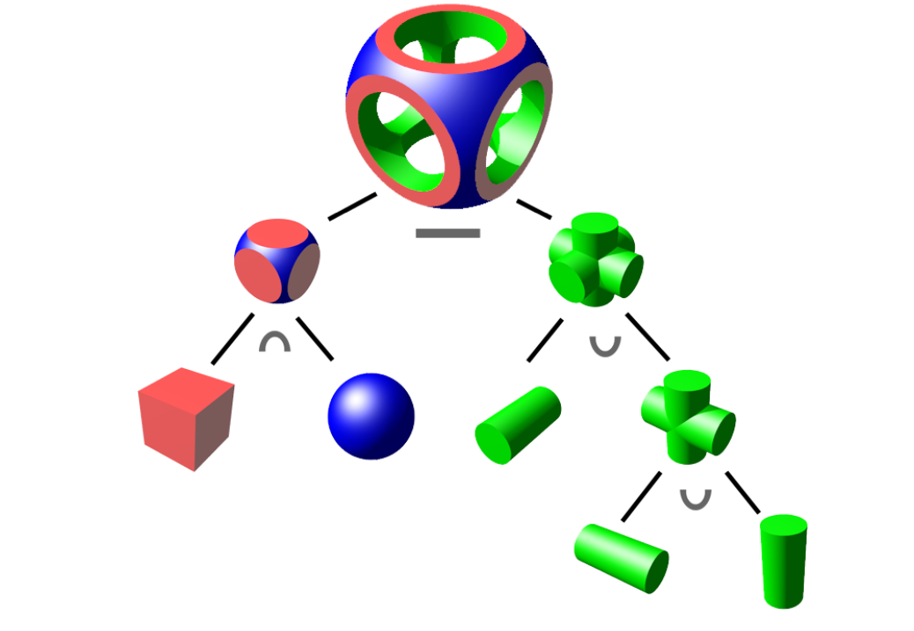

[](https://classroom.github.com/a/QzxY_R6r)

# Homework 5

This homework is going to give you experience writing classes in Python, subclassing, and using dunder methods to overload operators.

## Fraction

Write a class named `Fraction` (in fraction/fraction.py) that represents a rational number (a number that can be expressed as a quotient of two integers).

It is required to have the following methods:

- A constructor that takes two integers, `numerator` and `denominator`.
  - If the denominator is set to 0, a `ZeroDivisionError` exception should be raised. (This code is provided.)
  - The fraction should be stored in the lowest possible terms, that is to say if you are passed 28/20 it should be normalized to 7/5. (You may use the `math.gcd` function to help with this.)
- `numerator` and `denominator` should be accessible as read-only properties.  That is to say our `Fraction` is basically immutable once created.
- Implement the basic binary operators `+, -, *, and /`. It should be possible to use any of these with two `Fraction`s or a `Fraction` and an `int`.  Note that you may need to also implement the reversed operators for this to fully work.
  * See https://docs.python.org/3/reference/datamodel.html#object.__add__ for the signatures of these functions.
  * `__add__` and `__radd__` should implement addition.
  * `__sub__` and `__rsub__` should implement subtraction.
  * `__mul__` and `__rmul__` should implement multiplication.
  * `__truediv__` and `__rtruediv__` should implement division.
- The `__neg__` method should work to negate the `Fraction` instance.
- The `__eq__` method should be implemented to allow direct comparisons between two fractions.  (**Note**: Consider implementing this early, until you do, other tests may not pass!)
- The `__repr__` method should return `Fraction(numerator, denominator)` (where the names are replaced with their respective values).

Complete tests are provided in `fraction/test_fraction.py`, which you can run via `pytest fraction`.

### `__add__` and `__radd__` Example

If you defined a class that had an `__add__` method, it would be called when your class is on the left-hand side of an addition expression.

```python
class Example:
  def __init__(self, value):
    self.value = value

  def __add__(self, other):
    print("called add")
    return self.value + other
```

This would allow you to write code like:

```python
>>> x = Example(5)
>>> x + 10
called add
15
```

If you were to write `10 + x` however, it would call `int.__add__`, which of course doesn't know about your class.

For this reason, if `__add__` fails, Python will try `__radd__` on the right-hand side.

```python
class Example:
  def __init__(self, value):
    self.value = value

  def __add__(self, other):
    print("called add")
    return self.value + other

  def __radd__(self, other):
    print("called radd")
    return self.value + other
```

```python
>>> x = Example(5)
>>> 10 + x
called radd
15
```

You'll want to include the `__radd__`, `__rsub__`, etc. methods in your class to allow for this behavior.

## ESArray

In JavaScript, the Array datatype is similar to Python's `list`, but provides different methods, some of which Python doesn't have.

For this problem, you will write a subclass of `list` that provides some of these additional methods.

The class should be named `ESArray` and inherit from the built-in `list` class.

As an extension of `list`, you have access to the built-in methods, including its `__init__`.  Your ESArray therefore is-a `list`.

That means whenever you have a `self` parameter, you can treat it as you would a `list`.

It is important to understand this while implementing the below.

Place your solution in `esarray/esarray.py`.

You can test your solution by running `pytest esarray`.

### Specifications:

- `join` should accept a string, with a single argument `s` and return a string that results from joining each item in the list by the string `s`.
- `every` executes a provided function once for each item in the list, and return `True` if the function returns a true value for each element in the list, and `False` otherwise.
- `for_each` executes a provided function once for each item in the list.  It returns `None`.
- `flatten` returns a **new** `ESArray` with all list-like items in the original flattened.

### Examples:

```python
>>> from esarray import ESArray
>>> x = ESArray([1, -3, 10, 5])

>>> x.join("~~")
1~~-3~~10~~5

# -3 is less than 0
>>> x.every(lambda v: v > 0)
False

# each int in the list is nonzero (truthiness)
>>> x.every(lambda v: v)
True

>>> x.for_each(print)
1
-3
10
5

>>> y = ESArray([[3, 4], [5], 6, [7, [8, [9, 10]]]])
>>> y.flatten()
[3, 4, 5, 6, 7, 8, 9, 10]
>>> y   # y is not changed
[[3, 4], [5], 6, [7, [8, [9, 10]]]]
```


## Constructive Solid Geometry

In this assignment you will need to exercise your knowledge of operator overloading in Python to build an application that produces images of geometric objects using a technique called constructive solid geometry (CSG).

More information on CSG: https://en.wikipedia.org/wiki/Constructive_solid_geometry

CSG allows one to model arbitrary geometric objects by representing them as boolean operators applied to simple "primitives" representing basic geometric shapes.

Objects are represented as binary trees where the leaves are primitives and the nodes are operators (intersection, union, difference).



You will build an application that draws 2D CSG objects.

You will need to build two classes representing primitives: `Circle` and `Rectangle`. 
Additionally, you will write three classes representing operators: `Intersection`, `Union`, and `Difference`.

You will need to define an abstract base class `Drawable` that the primitives subclass which provides both an interface (set of abstract methods that the subclass must implement) and abstract methods, such as a `draw()` method that draws the shape.

To visualize the complex shapes representing by CSG binary trees, we will use the `Pillow` library which allows image manipulation on a pixel-by-pixel basis.

The classes representing primitives are all required to use `__contains__` to support the `in` operator to check whether a given tuple `(x, y)` is within the corresponding shape.

(`b in a` becomes `a.__contains__(b)`)

### Abstract Base Classes

Abstract Base Classes are parent classes where certain methods are marked with `@abstractmethod` and therefore must be implemented by subclasses.  We have provided an example in `csg/drawable.py` for you to use.

No code should be added within an `@abstractmethod` method.  Instead the behavior will be implemented in the subclasses.

(See the `Vector` example in the notes for an example of an abstract base class.)

Detailed specifications for your classes are below:

### Drawable

- `Drawable` should be an abstract base class.
- It should have an abstract `__contains__(self, point)` method.
- The `__and__(self, other)` method which overloads the `&` operator should return an instance of `Intersection` representing the intersection of the two operands.
- The `__or__(self, other)` method which overloads the `|` operator should return an instance of `Union` representing the union of the two operands.
- The `__sub__(self, other)` method which overloads the `-` operator should return an instance of `Difference`, representing the difference between two operands.
- The `draw(self, img)` method accepts an instance of `PIL.Image` and draws the shape represented by `self`.
  - A simple method to draw the shape is to then iterate over all pixels in a grid, checking whether each point is `in` the shape, and if it is, color the pixel.

`PIL.Image`

Your draw method receives an instance of `PIL.Image`.

You will want to use the following properties/methods to draw on it:
  - The `img.width` and `img.height` properties.
  - `img.putpixel(point, 0)` where `point` is a `(x, y)` tuple will fill a single point. Leave the second parameter as zero, to draw in black.

One thing to note is that is computer graphics, the coordinate system starts at the top left corner and extends towards the bottom right.

So `img.putpixel((0, 0), 0)` draws a single point in the upper left corner,
and `img.putpixel((img.width-1, img.height-1), 0)` draws a single point in the bottom right corner.

### Circle

- `Circle(x, y, radius)` should construct a circle centered at `x, y` with the given radius, storing the values in instance attributes.
- It must override the abstract `__contains__(self, point)` method, returning `True` if the point is within the circle.


### Rectangle

- `Rectangle(x0, y0, x1, y1)` should construct a rectangle, storing the values in instance attributes.
  - (x0, y0) represents the upper left point
  - (x1, y1) represents the lower right point
- It must override the abstract `__contains__(self, point)` method, returning `True` if the point is within the rectangle.

### Operator Classes

- Each of the operator classes `Intersection`, `Union`, and `Difference` should have a constructor that accepts two arguments: `shape1` and `shape2` and stores them as instance variables.
- `Intersection`'s `__contains__(self, point)` method returns `True` iff point is in both shapes specified in the initializer.
- `Union`'s `__contains__(self, point)` method returns `True` iff point is in either shape specified in the initializer.
- `Difference`'s `__contains__(self, point)` method returns `True` iff point is in `shape1` but not `shape2`.

**Tip: Don't overthink these, all three are relatively similar and simple.**

### Smiley Face

Once you're done building all of the classes, update the code to draw a smiley face within `main`.

You can draw it however you wish so long as it has two eyes and a mouth.

### Notes

#### Running Your Code

You are already set up with `poetry` from prior homeworks, you should run `poetry install` in the `homework5` directory to install the required 'Pillow' library.  (If you are getting errors on `import PIL` try this first!)

You can then run your application via: `poetry run python csg/csg.py`.

You will need to run tests via `poetry run pytest csg`.

#### Inheritance

Part of your grade for this assignment is for you to determine which classes should inherit from others.  Course staff will not help with questions specifically about this portion.  You need to determine whether a class should or shouldn't inherit.

#### Testing

When you run the tests for this portion, your output will be compared to the files in `csg/expected`.

For failing tests, you will see error output like:

```AssertionError: Output did not match, difference saved to error-union.png and diff-union.png```

The 'union.png' portion of the filename indicates which test was running, you can look in `csg/expected/union.png` (for example) to see the expected output.

The file that starts with `error-` is the output that your code generated.

The file that starts with `diff-` is a special diff file to help you debug your output.  In the `error-` images, pixels will be colored according to if they matched the expected output:

- Green pixels are pixels that matched the expected output.
- Red pixels are pixels that should have been black but were white.
- Blue pixels are pixels that should have been white but were black.
